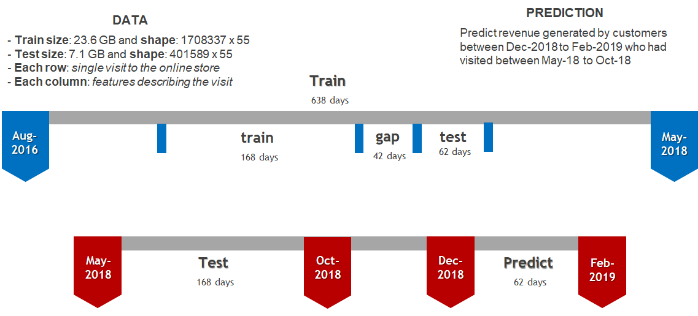
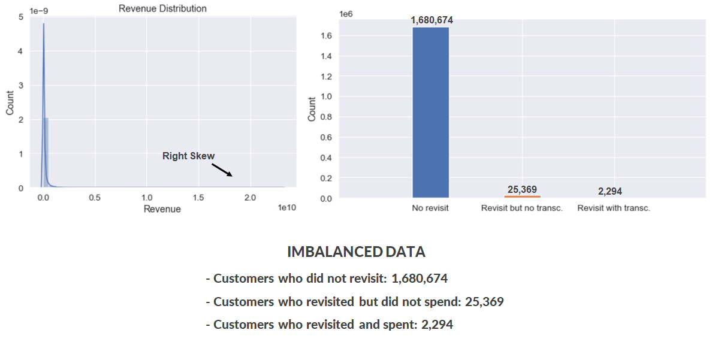
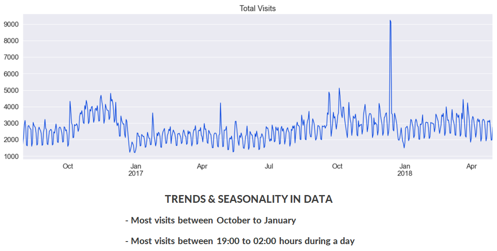
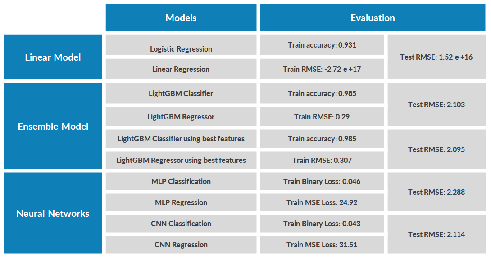
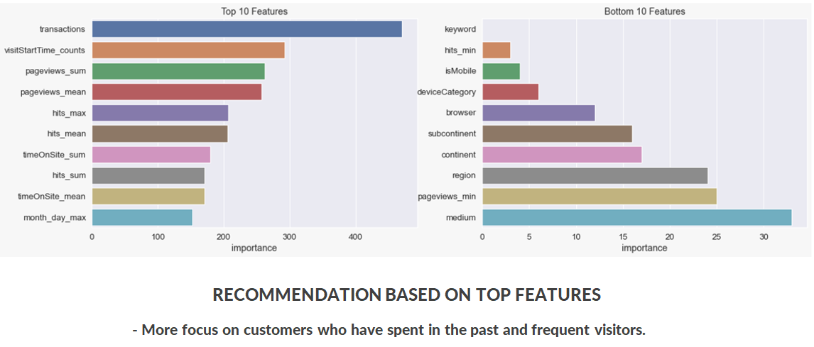

# Outline
  - [Problem Overview](#problem-overview)
  - [Dataset Descrption](#dataset-descrption)
  - [Exploratory Data Analysis](#exploratory-data-analysis)
  - [Training Approach](#training-approach)
  - [Training and Evaluation](#training-and-evaluation)
  - [Conclusion](#conclusion)
  - [References](#references)

### Problem Overview

Predict revenue generated per customer using Google Merchandise Store. Generally, 80 / 20 rule applies to such businesses where small percentage of cutomers generate most of the revenue. 

The outcome is intended to be used towards actionable operational changes and better use of marketing budgets.

### Dataset Descrption

Dataset used is from a competiton hosted by [Kaggle](https://www.kaggle.com/c/ga-customer-revenue-prediction/data).

  
**Attributes Overview** 
- fullVisitorId- A unique identifier for each user of the Google Merchandise Store.
- channelGrouping - The channel via which the user came to the Store.
- date - The date on which the user visited the Store.
- device - The specifications for the device used to access the Store.
- geoNetwork - This section contains information about the geography of the user.
- socialEngagementType - Engagement type, either "Socially Engaged" or "Not Socially Engaged".
- totals - This section contains aggregate values across the session.
- trafficSource - This section contains information about the Traffic Source from which the session originated.
- visitId - An identifier for this session. This is part of the value usually stored as the _utmb cookie. This is only unique to the user. For a completely unique ID, you should use a combination of fullVisitorId and visitId.
- visitNumber - The session number for this user. If this is the first session, then this is set to 1.
- visitStartTime - The timestamp .
- hits - This row and nested fields are populated for any and all types of hits. Provides a record of all page visits.
- customDimensions - This section contains any user-level or session-level custom dimensions that are set for a session. This is a repeated field and has an entry for each dimension that is set.
- totals - This set of columns mostly includes high-level aggregate data.

### Exploratory Data Analysis

### Training approach

* **Classification Task**
Predict if the customer who had visited during the train window(168 days) will revisit during the test window(62 days).

* **Regression Task**
Predict the sum of transactions if the customer who had visited during the train window(168 days) revisited during the test window(62 days).

 
### Training and Evaluation

### Conclusion

### References

  - https://github.com/kireeti-kunam/Google-Analytics-Customer-Revenue-Prediction
  - https://github.com/yuempark/DSW2019-revenue-prediction
  
  Thanks to the above kernels which helped approach the problem from a different perspective and engineer features.

