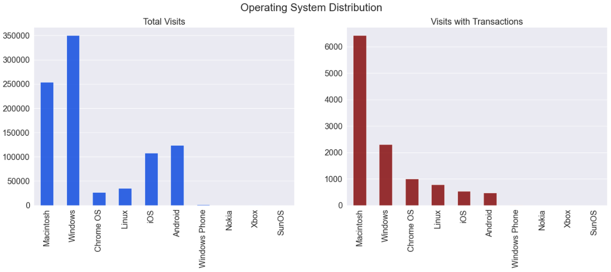

# Outline
  - [Problem Overview](#problem-overview)
  - [Dataset Descrption](#dataset-descrption)
  - [Exploratory Data Analysis](#exploratory-data-analysis)
  - [Data Preprocessing](#data-preprocessing)
  - [Training and Evaluation](#training-and-evaluation)
  - [Conclusion](#conclusion)
  - [References](#references)

### Problem Overview

Predict revenue generated per customer using Google Merchandise Store. Generally, 80 / 20 rule applies to such businesses where small percentage of cutomers generate most of the revenue.

### Dataset Descrption

Dataset used is from a competiton hosted by [Kaggle](https://www.kaggle.com/c/ga-customer-revenue-prediction/data).

* There are 2 training sets provided in the competition train.csv (1.4 GB) and train_v2.csv (24 GB) which was introduced later in the competition. The dataset used here is train.csv 
  
**Attributes Overview** 
- fullVisitorId- A unique identifier for each user of the Google Merchandise Store.
- channelGrouping - The channel via which the user came to the Store.
- date - The date on which the user visited the Store.
- device - The specifications for the device used to access the Store.
- geoNetwork - This section contains information about the geography of the user.
- socialEngagementType - Engagement type, either "Socially Engaged" or "Not Socially Engaged".
- totals - This section contains aggregate values across the session.
- trafficSource - This section contains information about the Traffic Source from which the session originated.
- visitId - An identifier for this session. This is part of the value usually stored as the _utmb cookie. This is only unique to the user. For a completely unique ID, you should use a combination of fullVisitorId and visitId.
- visitNumber - The session number for this user. If this is the first session, then this is set to 1.
- visitStartTime - The timestamp .
- hits - This row and nested fields are populated for any and all types of hits. Provides a record of all page visits.
- customDimensions - This section contains any user-level or session-level custom dimensions that are set for a session. This is a repeated field and has an entry for each dimension that is set.
- totals - This set of columns mostly includes high-level aggregate data.

### Exploratory Data Analysis

As mentioned before, the plots for the target variable clearly shows the trend of few customers generating most revenue.

Chrome browser is most widely used to access the store followed by Safari browser.

Desktop users are much higher than mobile devices.

Macintosh and Windows OS is widely used in destops which is evident from previous plot.

American continent generates maximum revenue and has most visits. Purchases from Asia and Europe are very low compared to the visits.

Uncategorized networks have most visits and revenues.

Most traffic is directed through Google and its affiliates.

Higher revenue is generated through referrals which must be mostly promotional content.

The vists had peaked during the months of November and December but a spike in tracations was only noticed during December.

### Data Preprocessing

* **Steps**
  - Date was divided into week_day, month_day, month and year, which were later included in training.
  - Removal of columns with a single constant value and null values.
  - Categorical encoding using label encoder.
  - Imputing null values in numerical columns.
  - Splitting the dataset in train, CV and test considering the temporal nature for the data.
  - Taking log of target variable transaction since it has few extremely high values.
 

### Training and Evaluation

The plan was to initially train a model on SVM regressor using RBF kernel and hyperparameter tuning. However, the training was taking forever to complete, so it had to be dropped. 
So the only model used is LightGBM which had a quick train time and had lower RMSE (had trained KNN and Linear regression models which very high RMSE).

**Best and Worst Features**

### Conclusion

There is a huge scope for engineering more features from the data and impoving the model. 

The LightGBM can be futher tuned on number of base learners and tree depth to check for improvements in performance.

**More models**

Training on Neural Network and Stacked regressors.  

### References

  - https://www.kaggle.com/sudalairajkumar/simple-exploration-baseline-ga-customer-revenue
  - https://www.kaggle.com/kabure/exploring-the-consumer-patterns-ml-pipeline
  
  Thanks to the above kernels which helped clear tons of doubts on extracting json and creating sensible visualizations.

